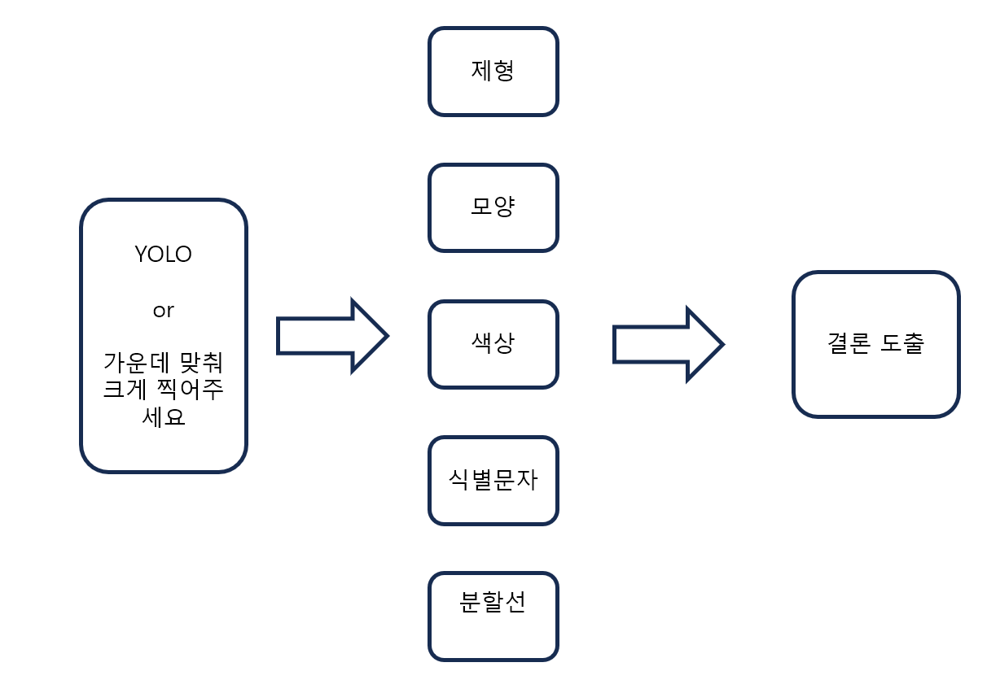

# 20231105 회의록
20231105 회의록 입니다.

## YOLO의 적합성
* COCO dataset은 객체를 class 80개로 나누어 놓은 학습가능한 이미지 데이터셋임
* yolo는 COCO dataset을 쓰고 80개의 객체를 분류 할 수 있음
* 약은 수천개의 class로 분류되는데 이걸 yolo가 다 구분 할 수 있을까? 힘들다고봄
* 또한 yolo 네트워크 자체가 object detection이 주목적 image classification이 아님

=> 다른방법 모색

## 다른방법
* 일단 우리 프로젝트를 하려면 대략 다음과 같은 구조가 되어야함  

* yolo는 나중에 생각하고 뒤에거부터 구현해보자 opencv로 가능할듯?

## 다음주까지
* 진혁: 모양구분
* 소윤: 글자인식
